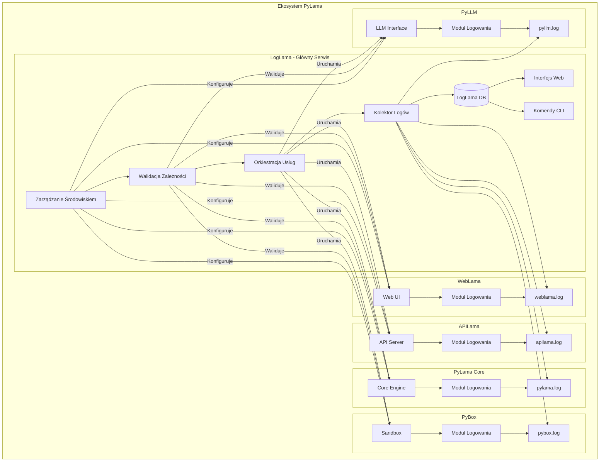

# Integracja Komponentów z LogLama

Ten dokument opisuje, jak każdy komponent w ekosystemie PyLama integruje się z LogLama, głównym serwisem zapewniającym scentralizowane logowanie, zarządzanie środowiskiem, walidację zależności i orkiestrację usług. Zawiera konfigurację specyficzną dla komponentów, punkty integracji i przykłady.

## Spis treści

- [Architektura komponentów](#architektura-komponentów)
- [WebLama](#weblama)
- [APILama](#apilama)
- [PyLama Core](#pylama-core)
- [PyBox](#pybox)
- [PyLLM](#pyllm)
- [LogLama](#loglama)

## Architektura komponentów

Poniższy diagram ilustruje, jak LogLama pełni rolę głównego serwisu w ekosystemie, zapewniając scentralizowane logowanie, zarządzanie środowiskiem, walidację zależności i orkiestrację usług dla wszystkich komponentów:



## WebLama

### Punkty integracji

WebLama integruje się z systemem logowania w następujących punktach:

1. **Konfiguracja logowania**: `weblama/weblama/logging_config.py`
2. **Uruchomienie kolektora logów**: `weblama/Makefile` i `weblama/scripts/start_log_collector.py`
3. **Przechowywanie logów**: `logs/weblama.log`

### Konfiguracja

WebLama używa strukturalnego logowania z formatem JSON, aby zapewnić, że logi mogą być prawidłowo zbierane i przetwarzane przez LogLama.

```python
# weblama/weblama/logging_config.py
import os
import logging
import json
from datetime import datetime

def setup_logging():
    """Set up logging for WebLama."""
    log_level = os.environ.get("WEBLAMA_LOG_LEVEL", "INFO").upper()
    log_dir = os.environ.get("LOGLAMA_LOG_DIR", "logs")
    log_file = os.path.join(log_dir, "weblama.log")
    
    # Create log directory if it doesn't exist
    os.makedirs(log_dir, exist_ok=True)
    
    # Configure root logger
    logging.basicConfig(
        level=getattr(logging, log_level),
        format="%(asctime)s - %(name)s - %(levelname)s - %(message)s",
        datefmt="%Y-%m-%d %H:%M:%S",
        handlers=[
            logging.FileHandler(log_file),
            logging.StreamHandler()
        ]
    )
    
    # Create JSON formatter for LogLama integration
    class JsonFormatter(logging.Formatter):
        def format(self, record):
            log_data = {
                "timestamp": datetime.utcnow().isoformat(),
                "level": record.levelname,
                "logger_name": record.name,
                "message": record.getMessage(),
                "component": "weblama",
                "version": "1.0.0"
            }
            
            # Add exception info if available
            if record.exc_info:
                log_data["exception"] = self.formatException(record.exc_info)
                
            return json.dumps(log_data)
    
    # Add file handler with JSON formatter for LogLama
    json_handler = logging.FileHandler(os.path.join(log_dir, "weblama.json.log"))
    json_handler.setFormatter(JsonFormatter())
    logging.getLogger().addHandler(json_handler)
    
    return logging.getLogger("weblama")
```

## APILama

### Punkty integracji

APILama integruje się z systemem logowania w następujących punktach:

1. **Konfiguracja logowania**: `apilama/apilama/logging_config.py`
2. **Middleware logowania żądań**: `apilama/apilama/middleware/logging_middleware.py`
3. **Przechowywanie logów**: `logs/apilama.log`

## PyLama Core

### Punkty integracji

PyLama Core integruje się z systemem logowania w następujących punktach:

1. **Konfiguracja logowania**: `pylama/pylama/logging_config.py`
2. **Logowanie modeli**: `pylama/pylama/models.py`
3. **Przechowywanie logów**: `logs/pylama.log`

## PyBox

### Punkty integracji

PyBox integruje się z systemem logowania w następujących punktach:

1. **Konfiguracja logowania**: `pybox/pybox/logging_config.py`
2. **Logowanie wykonania kodu**: `pybox/pybox/sandbox.py`
3. **Przechowywanie logów**: `logs/pybox.log`

## PyLLM

### Punkty integracji

PyLLM integruje się z systemem logowania w następujących punktach:

1. **Konfiguracja logowania**: `pyllm/pyllm/logging_config.py`
2. **Logowanie operacji LLM**: `pyllm/pyllm/models.py`
3. **Przechowywanie logów**: `logs/pyllm.log`

## LogLama

### Rola w ekosystemie

LogLama pełni rolę głównego serwisu w ekosystemie PyLama, odpowiedzialnego za:

1. **Zarządzanie środowiskiem**: Centralizacja zmiennych środowiskowych i konfiguracji
2. **Walidacja zależności**: Sprawdzanie i instalacja zależności dla wszystkich komponentów
3. **Orkiestracja usług**: Uruchamianie usług w odpowiedniej kolejności
4. **Zbieranie logów**: Centralne zbieranie i przechowywanie logów ze wszystkich komponentów
5. **Interfejs użytkownika**: Przeglądanie, filtrowanie i analiza logów
6. **CLI**: Zarządzanie całym ekosystemem PyLama

### Komponenty LogLama

- **Kolektor logów**: Zbiera logi ze wszystkich komponentów
- **Baza danych**: Przechowuje logi w formacie umożliwiającym szybkie wyszukiwanie
- **Interfejs webowy**: Umożliwia przeglądanie i filtrowanie logów
- **CLI**: Umożliwia zarządzanie logami i komponentami z linii poleceń
- **Menedżer środowiska**: Zarządza zmiennymi środowiskowymi i konfiguracją
- **Walidator zależności**: Sprawdza i instaluje zależności
- **Orkiestrator usług**: Uruchamia i zatrzymuje usługi w odpowiedniej kolejności
