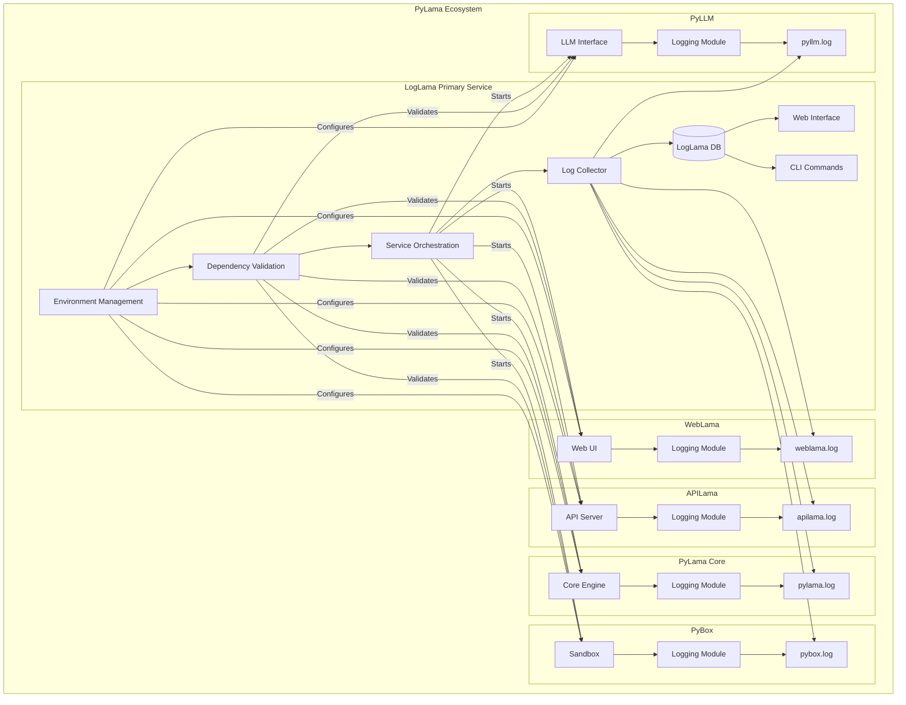

# Component Integration with LogLama

This document has been merged into the main README.md for improved clarity and maintainability.

For up-to-date information and integration diagrams, please refer to the [README.md](./README.md).

---

## Legacy Diagram (for reference)

For integration code samples, see the README.md and codebase examples.
