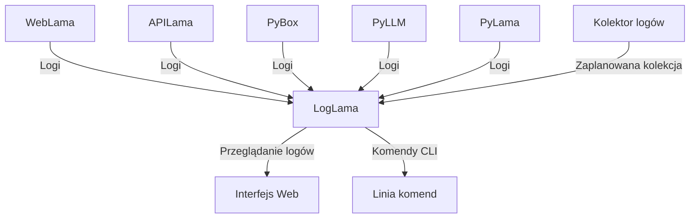
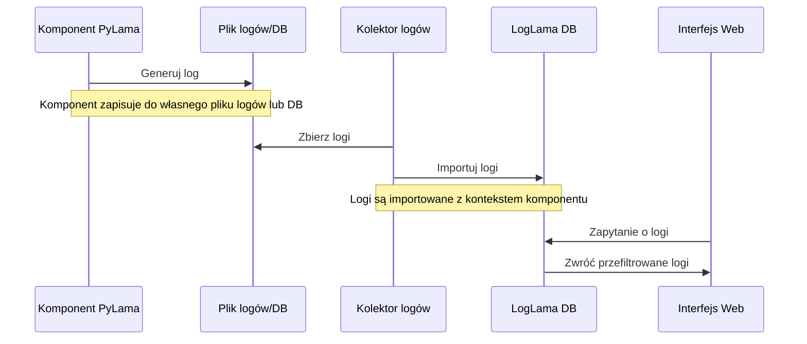

# LogLama - Integracja z Ekosystemem PyLama

Ten dokument opisuje szczegółowo, jak LogLama pełni rolę głównego serwisu w ekosystemie PyLama, zapewniając scentralizowane zarządzanie środowiskiem, walidację zależności, orkiestrację usług i kompleksowe logowanie.

## Spis treści

- [Przegląd](#przegląd)
- [Architektura](#architektura)
- [Komponenty](#komponenty)
- [Przepływ logów](#przepływ-logów)
- [Konfiguracja](#konfiguracja)
- [Komendy CLI](#komendy-cli)
- [Punkty integracji](#punkty-integracji)
- [Rozwiązywanie problemów](#rozwiązywanie-problemów)

## Przegląd

Ekosystem PyLama składa się z wielu komponentów, które współpracują ze sobą, aby zapewnić kompleksowe środowisko do generowania i wykonywania kodu Python. LogLama służy jako główny serwis, który uruchamia się jako pierwszy i koordynuje wszystkie pozostałe komponenty. Każdy komponent generuje logi, które są zbierane, przechowywane i udostępniane do analizy przez scentralizowany system logowania LogLama. Ten główny serwis zapewnia, że wszystkie komponenty mają prawidłową konfigurację przed uruchomieniem i zapewnia kompleksową widoczność całego ekosystemu.



## Architektura

Jako główny serwis w ekosystemie PyLama, LogLama implementuje architekturę hub-and-spoke, gdzie służy jako centralny hub, który koordynuje wszystkie inne komponenty (spoke) i zbiera ich logi. System jest zaprojektowany, aby być:

- **Scentralizowany**: Wszystkie logi są przechowywane w jednej bazie danych dla łatwego wyszukiwania
- **Nieinwazyjny**: Komponenty mogą nadal używać swoich istniejących mechanizmów logowania
- **Elastyczny**: Obsługuje zarówno zbieranie logów w czasie rzeczywistym, jak i wsadowe
- **Skalowalny**: Może obsługiwać logi z wielu komponentów i usług
- **Skoordynowany**: LogLama uruchamia się jako pierwszy i zapewnia, że wszystkie komponenty mają prawidłową konfigurację
- **Zintegrowany**: Zapewnia zarządzanie środowiskiem, walidację zależności i orkiestrację usług

```
+----------------+    +----------------+    +----------------+
|                |    |                |    |                |
|    WebLama     |    |    APILama     |    |     PyBox      |
|                |    |                |    |                |
+-------+--------+    +-------+--------+    +-------+--------+
        |                     |                     |
        |                     |                     |
        v                     v                     v
+-------+---------------------+---------------------+--------+
|                                                            |
|                         LogLama                            |
|                                                            |
+-----------------------------+----------------------------+-+
                              |                            |
                              v                            v
                    +---------+----------+      +---------+---------+
                    |                    |      |                   |
                    |   Web Interface    |      |   CLI Commands    |
                    |                    |      |                   |
                    +--------------------+      +-------------------+
```

## Komponenty

### LogLama

LogLama jest głównym serwisem w ekosystemie PyLama, odpowiedzialnym za scentralizowane zarządzanie środowiskiem, walidację zależności, orkiestrację usług i kompleksowe logowanie. Jako pierwszy uruchamiany serwis, LogLama zapewnia:

- Scentralizowane zarządzanie zmiennymi środowiskowymi poprzez wspólny plik `.env`
- Walidację i instalację zależności dla wszystkich komponentów
- Orkiestrację usług i monitorowanie stanu
- Bazę danych SQLite do przechowywania logów ze wszystkich komponentów
- Interfejs webowy do przeglądania, filtrowania i wyszukiwania logów
- Komendy CLI do zarządzania całym ekosystemem PyLama
- Zaplanowany kolektor logów do automatycznego zbierania logów
- Wielojęzyczne wsparcie dla logowania z Pythona, JavaScriptu, Basha i innych języków

### Kolektor logów

Usługa działająca w tle, która okresowo zbiera logi ze wszystkich komponentów i importuje je do bazy danych LogLama. Kolektor może:

- Działać jako daemon w tle
- Być zaplanowany do uruchamiania w określonych interwałach
- Być ręcznie uruchamiany za pomocą komend CLI

### Logowanie komponentów

Każdy komponent w ekosystemie PyLama używa strukturalnego logowania z informacjami kontekstowymi, aby zapewnić, że logi mogą być prawidłowo zbierane i kategoryzowane. Komponenty obejmują:

- **WebLama**: Interfejs webowy dla ekosystemu PyLama
- **APILama**: Usługa API dla ekosystemu PyLama
- **PyBox**: Środowisko wykonawcze Python w piaskownicy
- **PyLLM**: Integracja modelu języka Python
- **PyLama**: Główny silnik generowania i wykonywania kodu Python

## Przepływ logów

Poniższy diagram ilustruje, jak logi przepływają przez system:



## Konfiguracja

### Zmienne środowiskowe

System logowania używa następujących zmiennych środowiskowych do konfiguracji:

| Zmienna | Opis | Domyślna wartość |
|----------|-------------|--------|
| LOGLAMA_LOG_DIR | Katalog do przechowywania plików logów | ./logs |
| LOGLAMA_LOG_LEVEL | Poziom logowania dla LogLama | INFO |
| LOGLAMA_DB_PATH | Ścieżka do bazy danych LogLama | logs/loglama.db |
| LOGLAMA_MAX_MESSAGE_LENGTH | Maksymalna długość wiadomości logów | 2000 |
| COLLECT_INTERVAL | Interwał zbierania logów (sekundy) | 300 |

### Konfiguracja komponentów

Każdy komponent musi być skonfigurowany do używania strukturalnego logowania z następującymi informacjami kontekstowymi:

- Nazwa komponentu
- Wersja komponentu
- Nazwa loggera

Przykładowa konfiguracja dla WebLama:

```python
import logging
import structlog

def setup_logging():
    structlog.configure(
        processors=[
            structlog.stdlib.add_log_level,
            structlog.stdlib.PositionalArgumentsFormatter(),
            structlog.processors.TimeStamper(fmt="iso"),
            structlog.processors.JSONRenderer()
        ],
        context_class=dict,
        logger_factory=structlog.stdlib.LoggerFactory(),
    )
    
    # Dodaj kontekst komponentu
    logger = structlog.get_logger().bind(
        component="weblama",
        version="1.0.0"
    )
    
    return logger
```

## Komendy CLI

CLI PyLama udostępnia następujące komendy do zarządzania logami:

### Przeglądanie logów

```bash
# Przeglądaj logi z filtrowaniem
pylama logs --service weblama --level info --limit 50

# Przeglądaj logi ze wszystkich usług
pylama logs --service all
```

### Zbieranie logów

```bash
# Zbieraj logi z określonej usługi
pylama collect-logs --services weblama

# Zbieraj logi ze wszystkich usług
pylama collect-logs
```

### Zarządzanie kolektorem logów

```bash
# Uruchom daemon kolektora logów
pylama log-collector start --interval 300

# Sprawdź status kolektora logów
pylama log-collector status

# Zatrzymaj daemon kolektora logów
pylama log-collector stop
```

## Punkty integracji

### WebLama

WebLama integruje się z systemem logowania w następujących punktach:

1. **Konfiguracja logowania**: `weblama/weblama/logging_config.py`
2. **Uruchomienie kolektora logów**: `weblama/Makefile` i `weblama/scripts/start_log_collector.py`
3. **Przechowywanie logów**: `logs/weblama.log`

### APILama

APILama integruje się z systemem logowania w następujących punktach:

1. **Konfiguracja logowania**: `apilama/apilama/logging_config.py`
2. **Middleware logowania żądań**: `apilama/apilama/middleware/logging_middleware.py`
3. **Przechowywanie logów**: `logs/apilama.log`

### PyLama

PyLama integruje się z systemem logowania w następujących punktach:

1. **Konfiguracja logowania**: `pylama/pylama/logging_config.py`
2. **Logowanie modeli**: `pylama/pylama/models.py`
3. **Przechowywanie logów**: `logs/pylama.log`

### PyBox

PyBox integruje się z systemem logowania w następujących punktach:

1. **Konfiguracja logowania**: `pybox/pybox/logging_config.py`
2. **Logowanie wykonania kodu**: `pybox/pybox/sandbox.py`
3. **Przechowywanie logów**: `logs/pybox.log`

### PyLLM

PyLLM integruje się z systemem logowania w następujących punktach:

1. **Konfiguracja logowania**: `pyllm/pyllm/logging_config.py`
2. **Logowanie operacji LLM**: `pyllm/pyllm/models.py`
3. **Przechowywanie logów**: `logs/pyllm.log`

## Rozwiązywanie problemów

### Brakujące logi

Jeśli logi z komponentu nie pojawiają się w LogLama, sprawdź:

1. Czy komponent jest prawidłowo skonfigurowany do używania strukturalnego logowania
2. Czy plik logów istnieje i ma odpowiednie uprawnienia
3. Czy kolektor logów jest uruchomiony i działa prawidłowo
4. Czy ścieżka do pliku logów jest prawidłowa w konfiguracji kolektora

### Problemy z kolektorem logów

Jeśli kolektor logów nie działa prawidłowo:

```bash
# Sprawdź status kolektora
pylama log-collector status

# Zatrzymaj i uruchom ponownie kolektor
pylama log-collector stop
pylama log-collector start --interval 300

# Sprawdź logi kolektora
cat logs/log_collector.log
```

### Diagnostyka LogLama

LogLama zawiera narzędzia diagnostyczne do rozwiązywania problemów:

```bash
# Uruchom diagnostykę LogLama
python -m loglama.cli.main diagnose

# Sprawdź zdrowie systemu logowania
python -m loglama.cli.main diagnose -c health

# Wygeneruj kompleksowy raport diagnostyczny
python -m loglama.cli.main diagnose -c report -o raport_diagnostyczny.json
```
