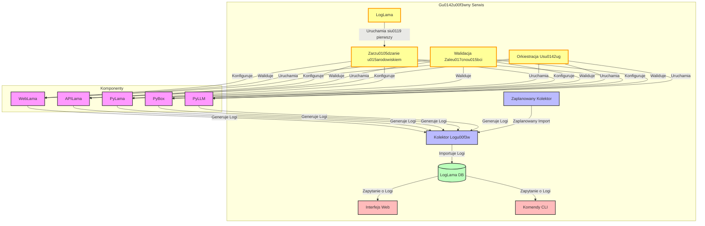
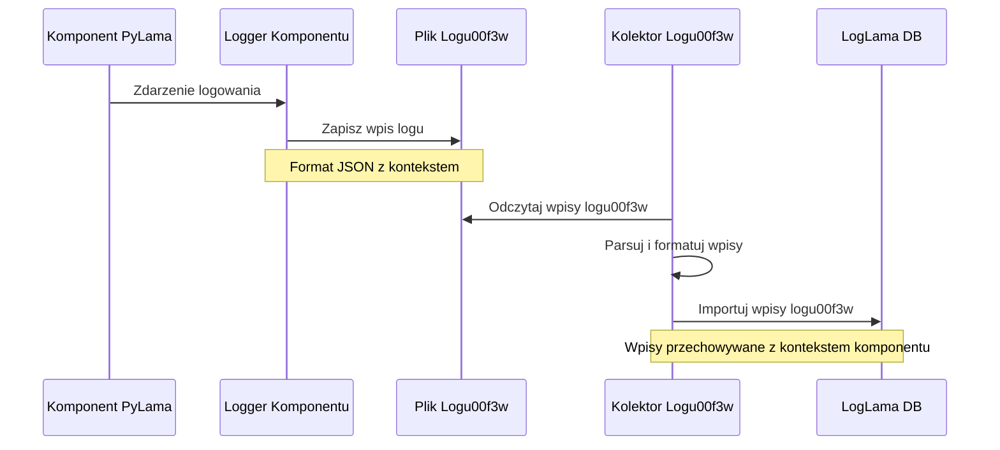
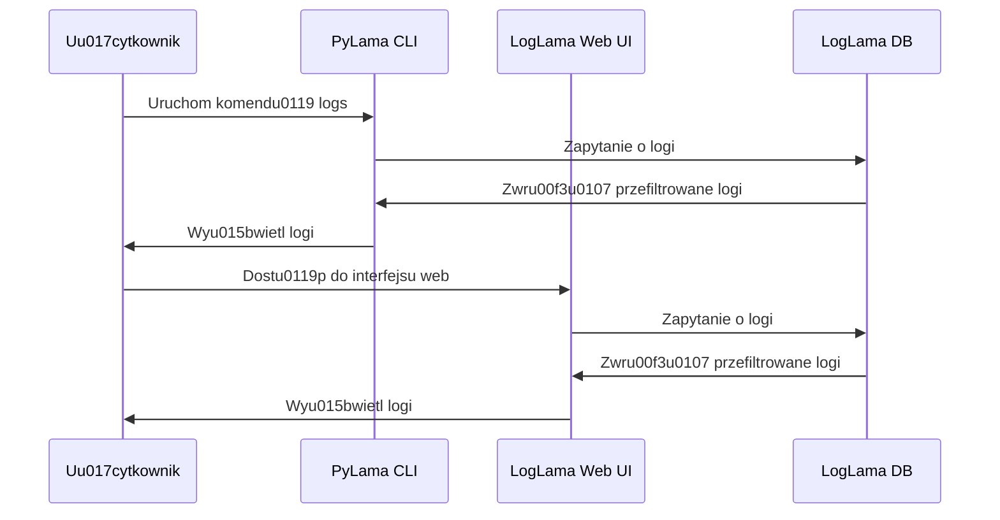
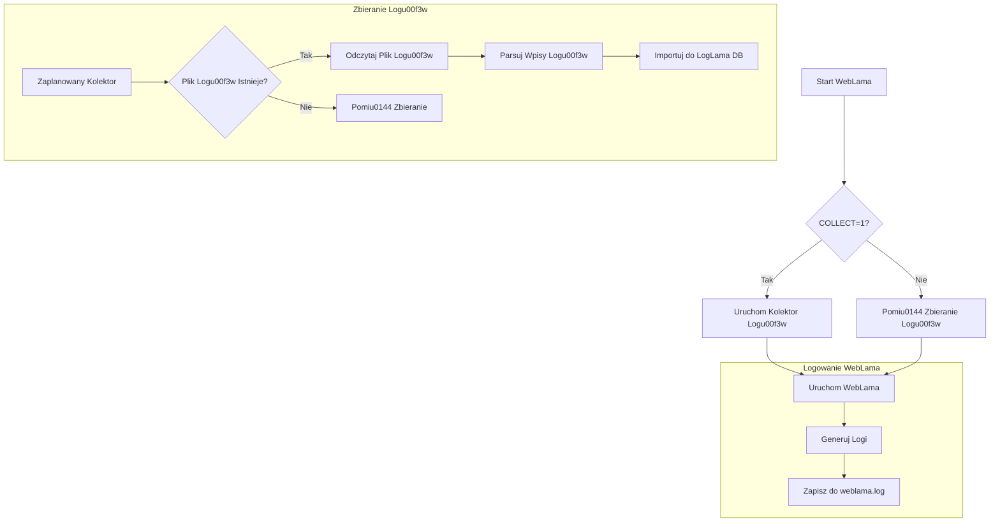
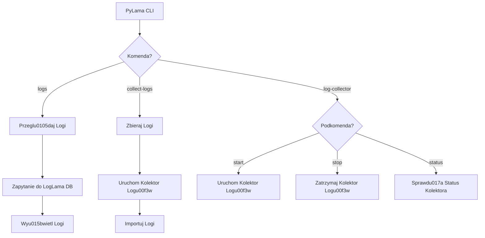
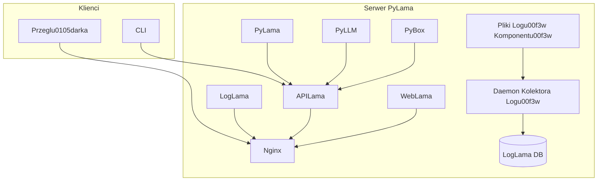
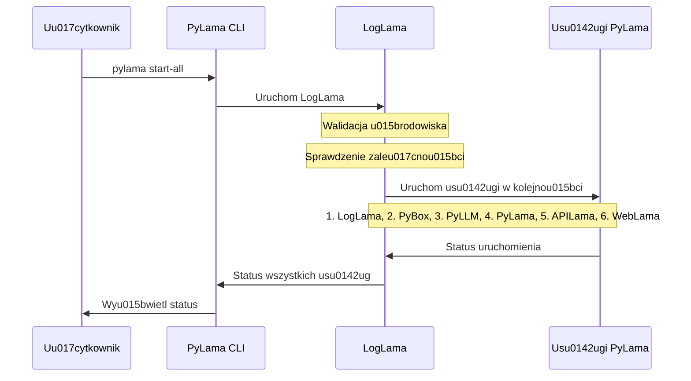
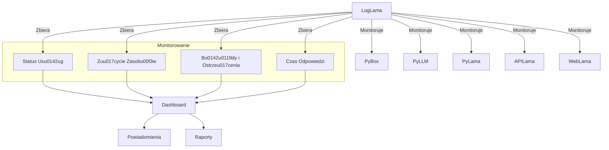
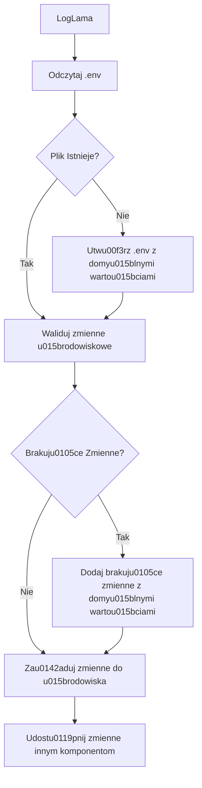
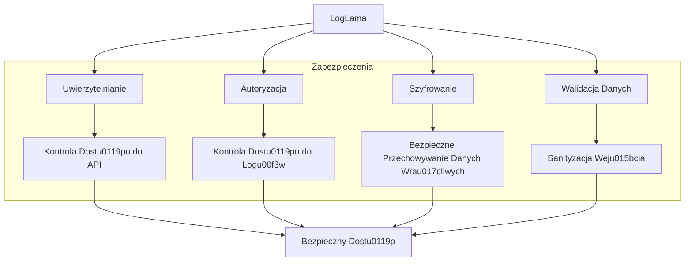

# LogLama: Diagramy Techniczne

Ten dokument zawiera szczegu00f3u0142owe diagramy techniczne architektury systemu logowania LogLama, przepu0142ywu danych i interakcji miu0119dzy komponentami. LogLama peu0142ni rolu0119 gu0142u00f3wnego serwisu w ekosystemie PyLama, zapewniaju0105c scentralizowane logowanie, zarzu0105dzanie u015brodowiskiem, walidacju0119 zaleu017cnou015bci i orkiestracju0119 usu0142ug.

## Architektura Systemu

### Architektura wysokiego poziomu



### Szczegu00f3u0142owa architektura komponentu00f3w

```
+----------------------------------------------+
|                  Ekosystem PyLama            |
+----------------------------------------------+
|                                              |
|  +------------------+  +------------------+  |
|  |     WebLama      |  |     APILama      |  |
|  +------------------+  +------------------+  |
|  | - logging_config |  | - logging_config |  |
|  | - weblama.log    |  | - apilama.log    |  |
|  +------------------+  +------------------+  |
|                                              |
|  +------------------+  +------------------+  |
|  |     PyLama       |  |      PyBox       |  |
|  +------------------+  +------------------+  |
|  | - logging_config |  | - logging_config |  |
|  | - pylama.log     |  | - pybox.log      |  |
|  +------------------+  +------------------+  |
|                                              |
|  +------------------+  +------------------+  |
|  |      PyLLM       |  |     LogLama      |  |
|  +------------------+  +------------------+  |
|  | - logging_config |  | - log_collector  |  |
|  | - pyllm.log      |  | - web_interface  |  |
|  +------------------+  | - cli_commands   |  |
|                        | - loglama.db     |  |
|                        +------------------+  |
|                                              |
+----------------------------------------------+
```

## Przepu0142yw Danych

### Przepu0142yw zbierania logu00f3w



### Przepu0142yw zapytau0144 o logi



## Interakcje Komponentu00f3w

### Integracja WebLama



### Integracja PyLama CLI



## Schemat Bazy Danych

```
+-------------------+
|    log_records    |
+-------------------+
| id (PK)           |
| timestamp         |
| level             |
| level_number      |
| logger_name       |
| message           |
| component         |
| version           |
| exception         |
| context           |
+-------------------+
```

## Architektura Wdrou017ceniowa



## Przepu0142yw Uruchamiania Usu0142ug



## Architektura Monitorowania



## Przepu0142yw Zarzu0105dzania u015arodowiskiem



## Architektura Bezpieczeu0144stwa


